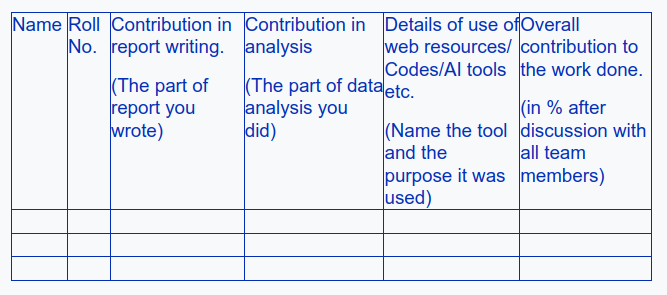

# DS - 2 : Statistics and Probability
## Group Assignment - Case Study : 7 : Lip Products in Indonesia

### Deadline : March 27, 2024 

## Members:

- Kunal Sharma B23079
- Arani Ghosh B23119
- Arka Mukhopadhyay B23120
- Ayuj Aryan B23198
- Pranab Ray B23169

## Instruction Highlights: 

- One submission per group - done by leader.

- Use provided LaTeX format.
  
- Minimum expectation - reproduce the report, including data and results, in a well-formatted manner. Additionally, strive to bring fresh insights to the analysis.
- You can utilize basic descriptive statistics discussed in class, as well as other statistical analysis tools/methods to enhance your analysis.
  
- There are various ways to improve the quality of your work and potentially earn bonus marks, such as:

    - Adding more statistics, graphs, and analysis to enrich the report.
    - Incorporating additional or recent data to enhance the analysis.
    - Conducting analysis inspired by the assigned case study but using data from a different country/domain.
    - Creating a completely new report using publicly available data from various sources. e.g.
  
- AI tools can be used to add a final touch to your work, but you MUST put in substantial effort yourself. You can use generative AI tools to improve language/correct grammar or to create scripts for data analysis, as well as data visualization tools for storytelling.

## Final Submission:
- Your final submission should be a .zip folder containing:

    - All LaTeX source files.
    - Images used in the report in .eps or .pdf format.
    - Datasets used in the report, along with corresponding links in the reference section.
    - Scripts used for analysis and data visualization.
    - Soft copies of any additional documents or reports used in the study.

- At the end of your report, include a declaration in tabular form detailing each team member's contributions, analysis, and use of resources to ensure acknowledges each member's effort.
- Also add the details of the addition work done as described in point 7 (descriptve stats) above on the last page of the report.

- TABLE:  
  

## Links Provided:

- [Census - Website](https://www.census.gov/)
- [Census - 2024 Data](https://www.census.gov/data-tools/demo/idb/#/table?COUNTRY_YEAR=2024&COUNTRY_YR_ANIM=2024&menu=countryViz&CCODE_SINGLE=**)
- [Census - Economic Indicators](https://www.census.gov/economic-indicators/)
- [Europa - datastories](https://data.europa.eu/en/publications/datastories)
- [Europa - understanding family spending](https://data.europa.eu/en/publications/datastories/understanding-family-spending-through-data-analysis)
- [data.gov](https://data.gov/)
- [data.gov catalog](https://catalog.data.gov/dataset?q=&sort=views_recent+desc)
- [Kaggle dataset](https://www.kaggle.com/datasets/je1429387/divvy-analysis-520421)
- [Europa - Data Visualization](https://data.europa.eu/en/publications/datastories/data-visualisation-guide-powerful-resource-learn-more-about-data)

